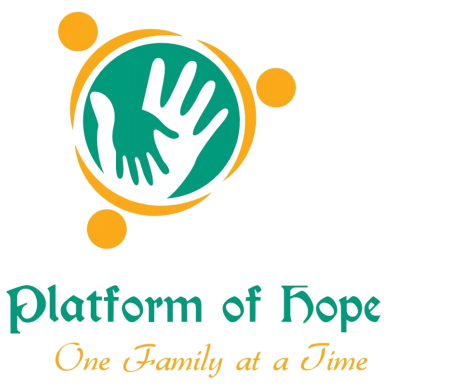

# Platform of Hope
## This is the repo for the Platform of Hope website hosted at platformofhope.com

## Instructions for accessing and updating the website:

1. Open a code editing software (ex: VSCode) and a terminal and run these commands:

    a. git clone https://github.com/ty730/platformofhope.git

    b. cd platformofhope

    c. npm install

    d. npm start (this will open a preview of the website)

2. Then edit the source code as needed. Edit src/Components/Events/index.js in order to add new events to the calendar and home page.

3. Run these commands to change the source code and have the changes get put onto the website:

    a. git add .

    b. git commit -m "your commit message"

    c. git push origin master

4. Login to Netlify (https://app.netlify.com/login/email)

    a. Click Sites -> platformofhope.com -> Deploys (Check if new changes are being deployed)

<!--
Here are some general steps to update the page, let me know if anyone has questions about these since they can be complicated to follow.
1. On GitHub, fork and clone this repository that stores the code for the website: https://github.com/ty730/platformofhope
2. Then edit the source code as needed. Edit src/Components/Events/index.js in order to add new events to the calendar and home page.
3. Commit and push the changes made back to GitHub
4. Login to Netlify (https://app.netlify.com/login/email)
5. Click Sites -> platformofhope.com -> Site Settings -> Build & Deploy -> Manage repository -> Link to a different repository
6. Then select your repository that you made the changes to and you should be able to deploy the updated version!
Note: if whoever is making updates is having trouble with Netlify they can also make a pull request to my repository and it should automatically update the website. Since my repository is set up for automatic deployment to Netlify currently.
 -->